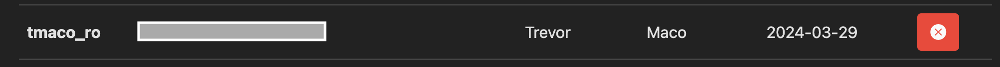
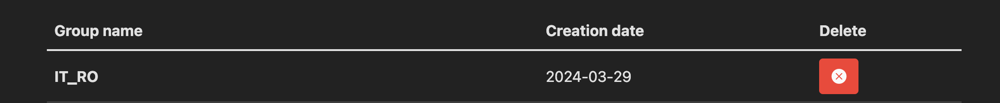
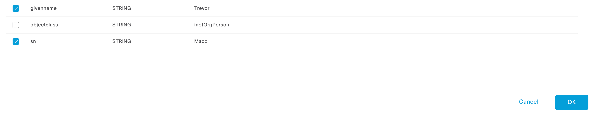
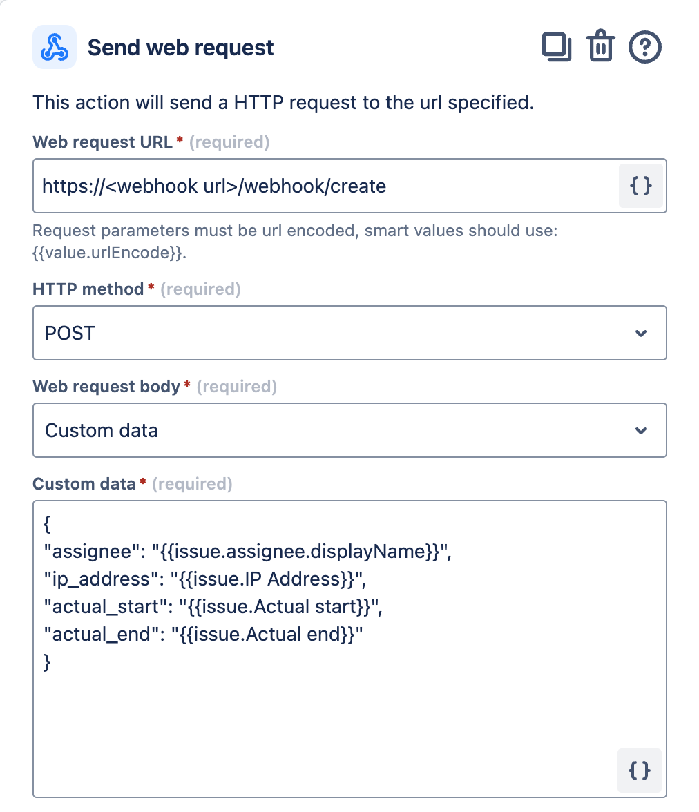
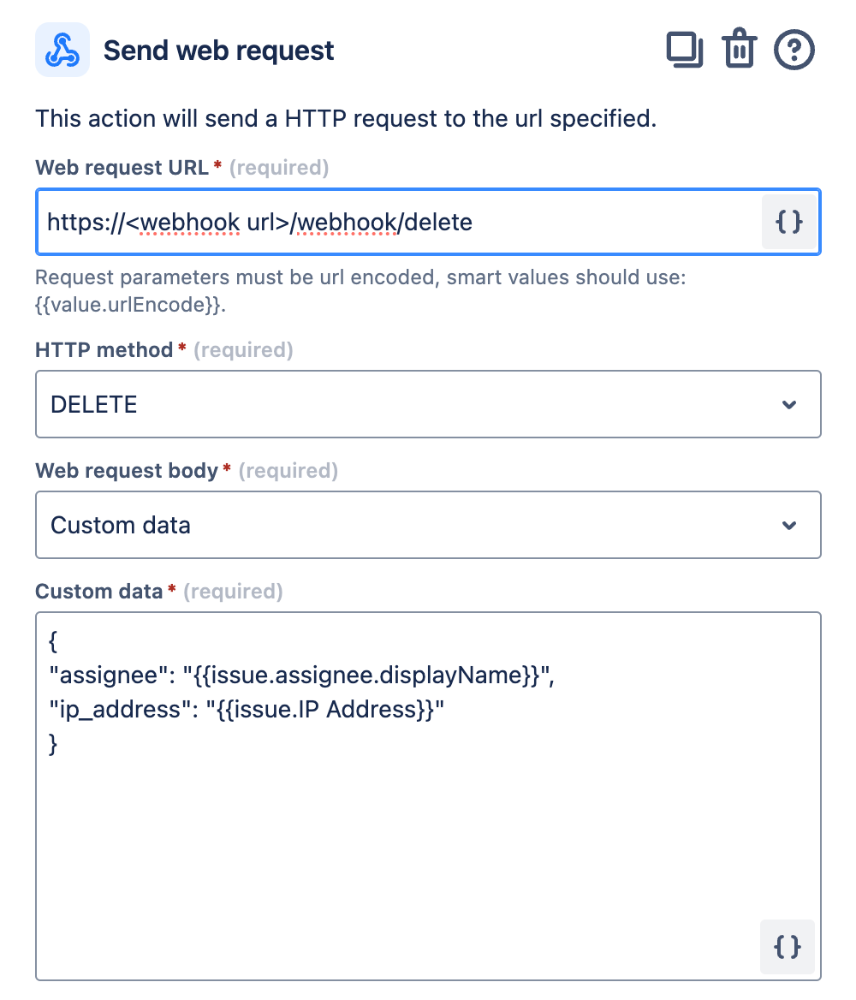
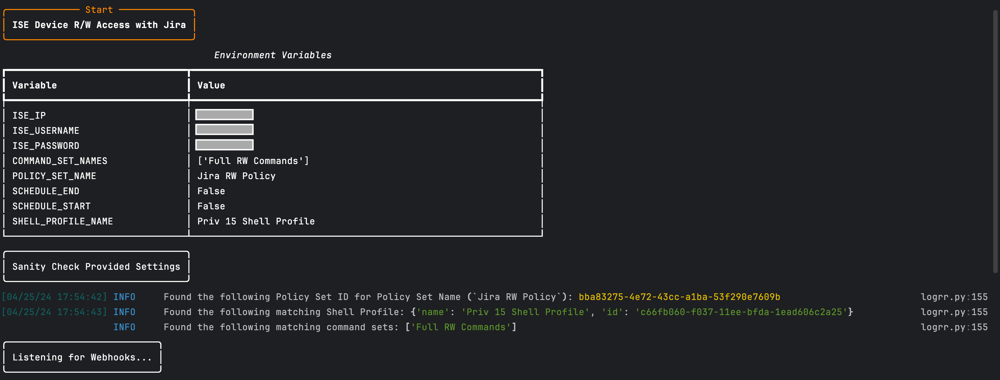
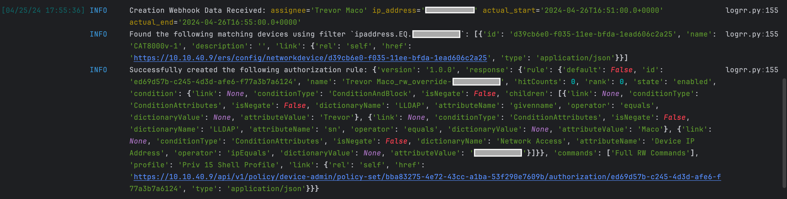
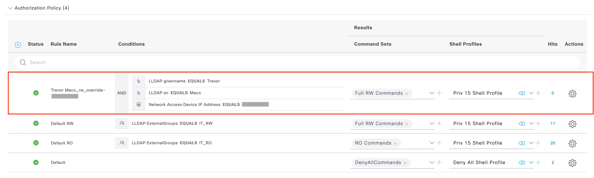
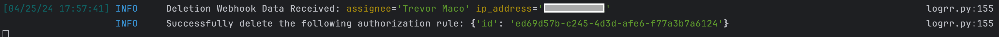
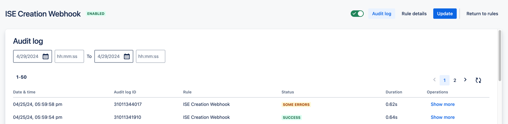

# ISE Device RW Access Policy Automation using Jira Issues

This application programmatically creates/deletes a `Device Authorization Policy` (TACACS+) rule for a `user` (ISE Internal or External LDAP) based on a Jira Issue.

The working example matches a device on `IP Address` and users on `First Name`, `Last Name` fields in a generic LDAP Database when creating a new rule. Users are under a `Read-Only` policy by default with restricted commands on all devices, but users will be granted `Write Access` via Jira Issues for a (optional) specified period of time.

**Note**: 
* The application assumes a Device Policy, Command Set, and Shell Profile used with the rule exist within ISE. For more information on ISE TACACS+ and these components, refer to the [ISE Documentation](https://www.cisco.com/c/en/us/td/docs/security/ise/2-4/admin_guide/b_ISE_admin_guide_24/m_ise_tacacs_device_admin.html). 
* Multiple IPs can be specified to match multiple devices in a single rule by providing a comma seperated list in the Jira Issue: "X.X.X.X,Y.Y.Y.Y"

**Warning**: This application only works with ISE 3.X or later (using the OpenAPI Policy API)

### Scheduled Start/End Feature
This application supports a delayed creation of the Authorization Rule and/or a delayed removal of the Authorization Rule. Specifying the Creation and Deletion time can represent a "change window" for temporary elevated access. If either feature is disabled, rules will be created or deleted immediately (with their respective Webhooks). Enabling this feature requires the Jira "Actual Start" and "Actual End" fields.

## Contacts
* Trevor Maco
* Mark Orszycki


## Solution Components
* Python
* FastAPI
* ISE 3.X or later
* Jira

## Prerequisites
### ISE

----

#### ISE REST APIs
1. Login to your ISE PAN using the admin or other SuperAdmin user.
2. Navigate to `Administration > System > Settings` and select `ERS Settings` from the left panel.
3. Enable the ERS APIs by selecting **Enable ERS** for Read/Write
4. Do not enable CSRF unless you know how to use the tokens.
5. Select **Save** to save your changes.
6. The following ISE Administrator Groups allow REST API access:
    * SuperAdmin: Read/Write
    * ERSAdmin: Read/Write
    * ERSOperator: Read Only

##### Create REST API Users
You can use the default ISE admin account for ERS APIs since it has SuperAdmin privileges. However, it is recommended to create separate users with the ERS Admin (Read/Write) or ERS Operator (Read-Only) privileges to use the ERS APIs so you can separately track and audit their activities.

1. Navigate to `Administration > System > Admin Access`
2. Choose `Administrators > Admin Users` from the left pane
3. Choose `+Add > Create an Admin User` to create a new ers-admin and ers-operator accounts

#### User Datasource
When creating Device Authorization Rules by user, we need a user identity source. If using ISE Internal Users, simply create the desired number of users. If using AD, follow the AD Integration [guide](https://www.cisco.com/c/en/us/support/docs/security/identity-services-engine/215233-identity-service-engine-ise-and-active.html).

In this example, we will use a generic LDAP database (open source [LLDAP](https://github.com/lldap/lldap) project).
Refer to the project documentation for how to set up the LLDAP Server. Ultimately, we need users in a "Read Only" group (ex: IT_RO) with a First Name and Last Name, like:





To integrate LLDAP with ISE:
1. Navigate to `Work Centers > Device Administration > Ext Id Source`
2. Add a new `LDAP Identity Source`
3. Follow the steps in the included guide [LLDAP_ISE_Integration.pdf](IMAGES/LLDAP_ISE_Integration.pdf)
4. Once integrated, go to the `Attributes` tab, select `Add`, and select `Select Attributes from Directory`. Provide an example subject (ex: `tmaco_ro`) to "discover" the various LDAP fields. The `givenname` and `sn` fields represent "First" and "Last" name respectively. Select these fields to import them into ISE for use in policies.



#### Command Set, Shell Profile, Policy Set
Ensure all 3 components are created within ISE before running the application! Note the Names of the Policy Set, Command Set, and Shell Profile. For more information on ISE TACACS+ and these components, refer to the [ISE Documentation](https://www.cisco.com/c/en/us/td/docs/security/ise/2-4/admin_guide/b_ISE_admin_guide_24/m_ise_tacacs_device_admin.html).
* ```Command Set```: Contains the commands allowed for a user (`Work Centers > Device Administration > Policy Elements > Results > TACACS Command Sets`). 
  * In our example, we have 2 command sets: "RO Commands" (only show commands permitted), and "Full RW Commands" (all commands permitted via "Permit any command not listed below"). "Full RW Commands" will be assigned programmatically! 
* ```Shell Profile```: Defined Shell related attributes to assign to users (ex: Priv. Level)
  * In our example, we have 2 shell profiles: "RO Shell" (Privilege Level 1) and "RW Shell" (Privilege Level 15). "RW Shell" will be assigned programmatically!
* ```Policy Set```: Contains Authorization Rules (`Work Centers > Device Administration > Device Admin Policy Sets`). 
  * Create a Policy Set that matches devices on the desired "conditions" with the allowed protocols and authentication policy (LLDAP in our example).
  * In our example, create an Authorization Rule manually assigning users in the IT_RO group to the restricted RO Command Set and Shell Profile created.

### Jira

----

#### Jira Project
This application leverages a Jira `Software Project` with "Issues" that represent work necessary to complete on a device. Issue fields will be sent to the application. In our example, we use standard fields and "custom" fields.

#### Custom Issue Fields
To use custom issue fields, refer to the Jira [documentation](https://confluence.atlassian.com/adminjiraserver/adding-custom-fields-1047552713.html). In our example, we created a custom "Text field (single line)" called "IP Address", and associated the "Actual Start" and "Actual End" fields to issues (for the optional scheduling feature). We also use the "Assignee" field for the first and last name of the user.

**Note**: it's assumed the First and Last name of the Assignee match those in the LLDAP database!

#### Jira Automation
To integrate with our application, we leverage `Jira Automation` workflows. Refer to the documentation for a high level [overview](https://www.atlassian.com/software/jira/guides/automation/overview#what-is-automation). 

Before creating the Jira Automation, our application must be reachable via ```Webhook```. The Webhook URL must be the HTTPS URL of the machine hosting this integration (publicly reachable from the Internet), mapped to port 8000. For local testing, [ngrok](https://ngrok.com/download) can be used by copying the URL from the following command:
```
ngrok http 8000
```

Create 2 Jira Automation rules: 1 for creation of Authorization Rules, and 1 for deletion of Authorization Rules.
* ```Creation```:
  * Trigger: `Issue Transition from To Do to In Progress`
  * Action: `Then: Send web request`. Use the following configuration (the "Custom Data" section uses the fields enabled/created previously. The field names must match exactly!). Use the Webhook Address in the URL.
  
  
* ```Deletion```:
  * Trigger: `Issue Transition from In Progress to Done`
  * Action: `Then: Send web request`. Use the following configuration (the "Custom Data" section uses the fields enabled/created previously. The field names must match exactly!). Use the Webhook Address in the URL.

  

Ensure both rules are enabled!

**Note**: If using different Issue fields (or different names), the fields must be referenced with their exact name in the payload!

### General

----

#### Docker
This app provides a `Docker` file for easy deployment. If using `Docker`, install `Docker` [here](https://docs.docker.com/get-docker/).

## Installation/Configuration
1. Clone this repository with `git clone [repository name]`. To find the repository name, click the green `Code` button above the repository files. Then, the dropdown menu will show the https domain name. Click the copy button to the right of the domain name to get the value to replace [repository name] placeholder.
2. Rename the `.env_sample` file to `.env`. Rename `settings_example.py` to `settings.py` (in `src > config` directory).
3. Add the `ISE IP` and `ISE_USERNAME` and `ISE_PASSWORD` to `.env` from the prerequisites section "API User".
```dotenv
ISE_IP=''
ISE_USERNAME=''
ISE_PASSWORD=''
```
4. Plug in the names of the `Policy Set`, `Shell Profile`, and `Command Set` into `settings.py` from the prerequisite section. Enable or disable (True, False) the scheduled start and end feature.
```python
# ISE Device Admin Parameters (necessary to build new Authorization Rules)
POLICY_SET_NAME = "Jira RW Policy"
SHELL_PROFILE_NAME = "Priv 15 Shell Profile"
COMMAND_SET_NAMES = ["Full RW Commands"]

# Schedule Functionality (delayed start, scheduled end)
SCHEDULE_START = False
SCHEDULE_END = False
```
5. Set up a Python virtual environment. Make sure Python 3 is installed in your environment, and if not, you may download Python [here](https://www.python.org/downloads/). Once Python 3 is installed in your environment, you can activate the virtual environment with the instructions found [here](https://docs.python.org/3/tutorial/venv.html).
6. Install the requirements with `pip install -r requirements.txt`

## Usage

To start the application, use the following commands to run with python directly:
```
$ cd src
$ uvicorn main:app
```
or with the docker command:
```
$ docker-compose up -d --build
```

On start up, the app will verify the provided Authorization Rule components are defined in ISE, then it will begin listening for Webhooks.



To Create an Authorization Rule, move a Jira Issue from `To Do` to `In Progress`. Within a few seconds, a webhook will be received. The rule is either created immediately or scheduled for a future time (if enabled and the `Actual Start` and (optional) `Actual End` field are provided).



On ISE, we see the new Authorization Policy:


**Note**: DO NOT modify the rule name within ISE (the name is stored for programmatic deletion)

To Delete an Authorization Rule, move a Jira Issue from `In Progress` to `Done`. Within a few seconds, a webhook will be received. The rule will be deleted immediately (for cases where an issue is resolved before a change window is complete).



Logs can be found in the `logs` folder, as well as in the `Jira Automation Rule Audit Log` which will display the result of the Jira workflow and any returned errors.




### LICENSE
Provided under Cisco Sample Code License, for details see [LICENSE](LICENSE.md)

### CODE_OF_CONDUCT
Our code of conduct is available [here](CODE_OF_CONDUCT.md)

### CONTRIBUTING
See our contributing guidelines [here](CONTRIBUTING.md)

#### DISCLAIMER:
<b>Please note:</b> This script is meant for demo purposes only. All tools/ scripts in this repo are released for use "AS IS" without any warranties of any kind, including, but not limited to their installation, use, or performance. Any use of these scripts and tools is at your own risk. There is no guarantee that they have been through thorough testing in a comparable environment and we are not responsible for any damage or data loss incurred with their use.
You are responsible for reviewing and testing any scripts you run thoroughly before use in any non-testing environment.